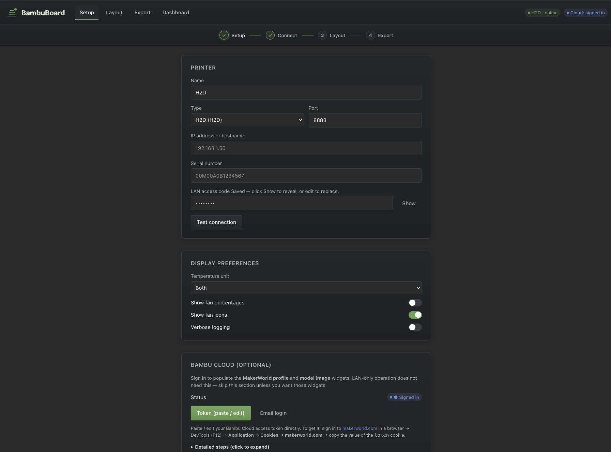
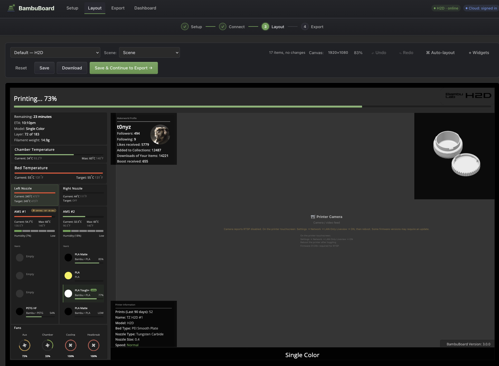
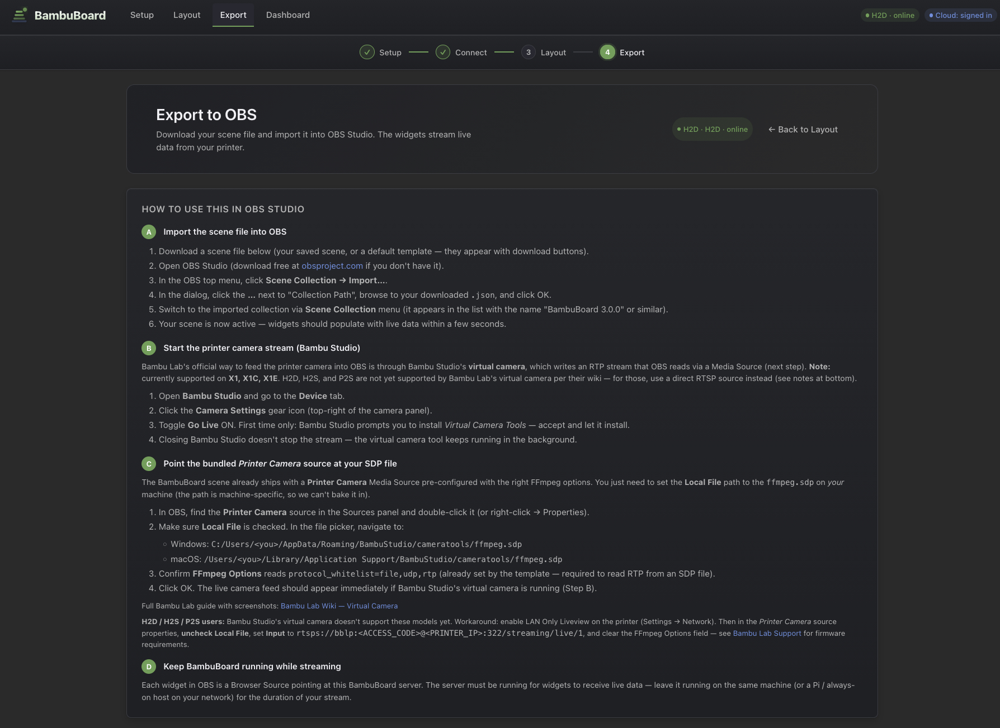
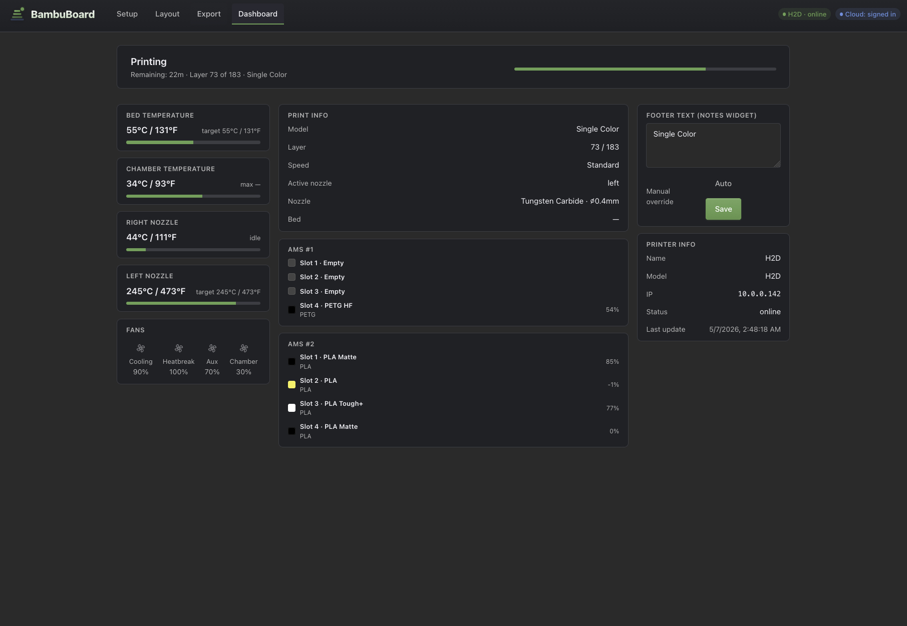

# BambuBoard

> **OBS dashboard widgets for Bambu Lab printers.** Live print stats overlays designed for streamers — drop a scene file into OBS Studio and you have a polished, real-time print dashboard on stream.

<p align="center">
  <strong>Setup → Connect → Layout → Export.</strong> Four steps, signposted in the app.
</p>

---

## Why v3? (the short story)

BambuBoard started as a dashboard for OBS browser-source widgets. Over time v2 grew into a full multi-printer management app — useful, but a different product. **v3.0 returns BambuBoard to its core:** a polished single-printer dashboard built around streaming overlays, with a guided setup flow, a visual scene-layout editor, and one-click export to OBS.

- **Want streaming widgets, a clean overlay, and quick OBS import?** You're in the right place.
- **Want multi-printer fleet management?** Stay on **v2.x** — see the [v2 branch](https://github.com/t0nyz0/BambuBoard/tree/v2). v3 is intentionally single-printer.

Everything else from v2 (LAN-only operation, Bambu Cloud auth, all the per-widget customizations) carries over. The major addition in v3 is the **scene editor** — drag widgets around an OBS-canvas-sized preview, then save & export the scene JSON in one click.

---

## Screenshots

The 4-step workflow inside BambuBoard:

| | |
|---|---|
| **1. Setup** — printer credentials + optional Bambu Cloud sign-in | **2. Layout** — visual scene editor with live widget previews on a 1920×1080 OBS canvas |
|  |  |
| **3. Export** — download the OBS scene `.json` and import instructions | **4. Dashboard** — live print monitor (separate from the workflow, open whenever) |
|  |  |

---

## Quickstart — Docker (recommended)

A single command. Multi-arch image (works on x86, Apple Silicon, Raspberry Pi):

```bash
docker run -d --name bambuboard -p 8080:8080 \
  -v $(pwd)/data:/usr/src/app/data \
  -v $(pwd)/config.json:/usr/src/app/config.json \
  ghcr.io/t0nyz0/bambuboard:latest
```

Then open **http://localhost:8080**. The first-run setup wizard appears automatically.

For docker-compose users, see [`docker-compose.yml`](docker-compose.yml) — `docker compose up -d` and you're done.

## Quickstart — from source

```bash
git clone https://github.com/t0nyz0/BambuBoard.git
cd BambuBoard
npm install
npm start
```

Open `http://localhost:8080`.

---

## The 4-step flow

When you open BambuBoard for the first time, you'll be guided through:

1. **Setup** (`/setup`) — Enter your printer's IP, serial number, and LAN access code. Test the connection from this page before saving.
2. **Connect** (still `/setup`, lower section) — BambuBoard asks the printer to identify itself via MQTT. Within a few seconds you'll see "Auto-detected: H2D" (or whichever model). The "Continue to Layout →" button lights up.
3. **Layout** (`/scene-editor`) — A 1920×1080 canvas auto-loads the matching default template for your printer type. Drag widgets, resize, change themes, snap to grid. When you're happy, click **Save & Continue to Export**.
4. **Export** (`/`) — Download the scene `.json` file. In OBS Studio: **Scene Collection → Import…** → pick the file. Done.

You'll need before starting:
- The printer's **IP address** (printer screen → Settings → Network).
- The **serial number** (Settings → Device Info, or back-panel sticker).
- The **LAN access code** (Bambu Studio → Device → Access Code).

---

## Supported printers

Printer type is **auto-detected from MQTT** when BambuBoard connects — no need to remember which model you picked. The detection mirrors [ha-bambulab](https://github.com/greghesp/ha-bambulab)'s logic (matches by MQTT `product_name`, falls back to hardware version).

> **Honesty about testing:** I personally own and actively test BambuBoard against the **X1 Carbon** and **H2D**. Every other model below is a "should work" — the detection logic, capability map, and widget set were ported from ha-bambulab (which is broadly tested), but I can't physically verify the others. If something looks off on your specific printer, please open an [issue](https://github.com/t0nyz0/BambuBoard/issues) with a screenshot + the relevant chunk of `localhost:8080/data.json` and I'll fix it.

| Model | BambuBoard type | Caps | Status |
|-------|-----------------|------|--------|
| X1 Carbon | `X1C` | Chamber temp | ✅ **Tested by maintainer** |
| H2D, H2D Pro | `H2D` | Chamber temp, dual nozzle, dual AMS | ✅ **Tested by maintainer** |
| X1 | `X1` | Chamber temp | ⚠️ Should work — community feedback welcome |
| X1E | `X1C` (mapped) | Chamber temp | ⚠️ Should work — community feedback welcome |
| P1P | `P1P` | — | ⚠️ Should work — community feedback welcome |
| P1S, P2S | `P1S` | — | ⚠️ Should work — community feedback welcome |
| A1 | `A1` | Single AMS | ⚠️ Should work — community feedback welcome |
| A1 Mini | `A1M` | Single AMS | ⚠️ Should work — community feedback welcome |
| H2C, H2S, X2D | `H2D` (mapped) | Chamber temp, dual nozzle, dual AMS | ⚠️ Should work — community feedback welcome |

**AMS variants:** any printer with a heating-capable AMS (AMS 2 Pro, AMS HT) gets a live drying indicator on the AMS widget when a dry cycle is running — `dry_time`, `dry_temperature`, animated fan icon. Older AMS / AMS Lite always reports zero so the indicator stays hidden, no model gating needed.

**Multi-AMS:** all printers support up to 4 chained AMS units via the AMS Hub. Add a second AMS widget to your scene with `?ams=1` (or `?ams=2`, `?ams=3`) to target the others.

---

## What's where

```
BambuBoard/
├── src/                  Server (Node, Express)
│   ├── server.js         Bootstrap
│   ├── mqtt.js           Single-printer MQTT client + printer auto-detect
│   ├── config.js         Load / save / migrate
│   ├── routes/           api, pages, auth, obsScene, video
│   └── lib/caps.js       PRINTER_CAPS map + printerTypeFromMqtt()
├── views/                Pretty-URL HTML pages
├── public/
│   ├── css/              theme, components, hub, dashboard, setup, scene-editor
│   ├── js/               nav (with stepper), hub, dashboard, setup, scene-editor
│   ├── assets/           jQuery, Material Symbols, fonts (local — no CDNs)
│   └── widgets/          OBS browser-source widgets (each its own folder)
├── OBS_settings/
│   └── templates/        Scrubbed default scenes for each printer family
├── data/                 Runtime state (gitignored): data.json, accessToken.json, note.json, scenes/
├── scripts/              build-widget-catalog.js, etc.
├── config.json           Local config (gitignored)
└── example.config.json
```

---

## Pages

- **`/setup`** — Step 1+2: Printer config, connection check, optional Bambu Cloud auth.
- **`/scene-editor`** — Step 3: Visual scene editor. Auto-loads the matching template for your printer type.
- **`/`** (Hub) — Step 4: Export. Saved scenes, default templates, and a collapsible widget gallery.
- **`/dashboard`** — Live print monitor. Capability-driven layout (P1P sees no chamber temp; H2D sees both AMS units and both nozzles). Not part of the setup flow — open whenever.
- **`/login`** — Bambu Cloud sign-in (only used when cloud auth is enabled).

---

## Widget catalog

Every widget is a standalone HTML page you add as a Browser Source in OBS. The hub gallery shows live previews; the scene editor lets you drag them onto a canvas.

<!-- WIDGET-CATALOG-START -->
| Widget | Description | Recommended size | Params | Cap-gated |
|--------|-------------|------------------|--------|-----------|
| **AMS** (`ams`) | Combined AMS card: chamber temp + humidity bar + drying status (AMS 2 Pro / AMS HT) + 4 tray rows. Active tray gets a green left-edge accent. Multi-AMS: ?ams=0\|1\|2\|3 (defaults to AMS #1). | 400×460 | `?ams=0` | — |
| **AMS humidity / temp (legacy)** (`ams-temp`) | Standalone humidity + chamber-temp + drying readout. Superseded by the combined `ams` widget which now includes this header above the trays. Kept for back-compat with custom scenes that reference it. | 400×120 | — | — |
| **AMS #2 humidity (legacy)** (`ams-temp-2`) | Standalone humidity + chamber-temp + drying readout for the second AMS. Superseded by the combined `ams2` widget which now includes this header above the trays. Kept for back-compat with custom scenes. | 400×120 | — | `hasDualAMS` |
| **AMS #2** (`ams2`) | Combined AMS #2 card (H2D only): chamber temp + humidity + drying status + 4 tray rows. Same layout as the primary `ams` widget but reads `ams.ams[1]`. | 400×460 | — | `hasDualAMS` |
| **Bed temperature** (`bed-temp`) | Heat-bed temp with target + progress bar. | 400×120 | — | — |
| **Chamber temperature** (`chamber-temp`) | Enclosed-chamber temperature (X1, X1C, H2D). | 400×120 | — | `hasChamberTemp` |
| **Fans** (`fans`) | All four fan speeds with animated spinning icons and circular gauge rings showing speed percentage. | 420×160 | — | — |
| **Model image** (`model-image`) | Preview image of the current model (requires Bambu Cloud auth for live MakerWorld images). | 400×300 | — | — |
| **Notes / footer** (`notes`) | Auto-updates with the model name each print; can be manually overridden from the dashboard. | 600×40 | — | — |
| **Nozzle info** (`nozzle-info`) | Nozzle type, size, current speed level. | 400×120 | — | — |
| **Nozzle temperature** (`nozzle-temp`) | Nozzle temperature with current/target and progress bar. Use ?nozzle=0 (right, default) or ?nozzle=1 (left) for dual-nozzle printers. | 400×120 | `?nozzle=0` | — |
| **Left nozzle temperature** (`nozzle-temp-2`) | Left nozzle temperature (H2D/dual-nozzle). Legacy widget — equivalent to nozzle-temp/?nozzle=1. | 400×120 | — | `hasDualNozzle` |
| **Print info** (`print-info`) | Total prints, model name, weight, nozzle/bed. | 400×160 | — | — |
| **Printer info** (`printer-info`) | Printer name, model, serial, IP. | 400×140 | — | — |
| **MakerWorld profile** (`profile-info`) | Followers, downloads, and stats from your MakerWorld profile (requires Bambu Cloud auth). | 400×180 | — | — |
| **Progress** (`progress-info`) | Print progress bar with status text and percentage. | 600×80 | — | — |
| **Version stamp** (`version`) | Shows BambuBoard version in a corner. | 200×30 | — | — |
| **Wi-Fi signal** (`wifi`) | Wireless signal strength. | 200×80 | — | — |
<!-- WIDGET-CATALOG-END -->

Regenerate this table after adding/changing widgets:
```bash
npm run build:widget-catalog
```

Cap-gated widgets are greyed out in the hub gallery for incompatible printer types (e.g. `chamber-temp` is hidden on P1P which has no chamber).

---

## URL parameters

Every widget supports query-string customization via `_customizer.js`:

- `?theme=dark|light|transparent` — color scheme
- `?accent=#51a34f` — accent color (hex)
- `?fontSize=14` — base font size in px
- `?title=My title` — override the widget's title text
- `?pad=8` — extra body padding in px

Plus widget-specific params (see catalog above) — e.g. `?ams=2` to point an AMS widget at the third unit.

---

## OBS scene templates

Two pre-built scenes are included, scrubbed of personal info:

- **`default-x1`** — X1, X1 Carbon, P1P, P1S, A1, A1 Mini (single nozzle, single AMS layout).
- **`default-h2d`** — H2D / H2D Pro (dual nozzle + dual AMS layout).

The scene editor auto-loads the right one based on the connected printer's type. You can also download the raw JSON from the Export page and import it directly into OBS.

Both templates use the **combined AMS widget** (chamber temp + humidity + drying status + tray contents in one card) and a uniform 3px-gap right rail: Chamber Temp → Bed Temp → Nozzle(s) → AMS → Fans, all top-to-bottom flush. Active nozzle and active filament tray are highlighted with a green left-edge accent + soft tint while printing.

---

## Bambu Cloud auth (optional)

Off by default. Enable in `/setup` to populate the `profile-info` and `model-image` widgets with live MakerWorld data. Sign-in flow uses email + verification code (and MFA if enabled on your Bambu account). Tokens are cached in `data/accessToken.json` (gitignored). LAN-only operation does not require this.

---

## Running offline / on a LAN

All assets (jQuery, Material Symbols, fonts) are bundled locally — no external CDN dependencies. The dashboard server only needs LAN access to your printer's MQTT port (8883 by default).

---

## Migrating from older versions

The first boot of v3 detects and migrates two legacy config shapes:

- **Old single-printer H2D fork** (flat `BambuBoard_printerURL` etc.) → new `printer` object with `type: "H2D"`.
- **Old multi-printer BambuBoard v2** (`printers[]` array) → first printer is kept; the rest are dropped with a warning. **Multi-printer is not supported in v3** — for that, stay on v2.x.

Both produce a `config.json.pre-merge-*-{timestamp}.bak` backup before overwriting. Legacy runtime files (`accessToken.json`, `note.json`, `public/data.json`) at the repo root are auto-moved into `data/` on first boot.

---

## Troubleshooting

- **"Test connection" fails** — verify the IP, port (8883), serial number, and access code. The printer must be on the same LAN.
- **No data appearing on dashboard** — check the printer's "LAN Mode Liveview" setting is enabled (Settings → General). Also check the "Connect" panel on `/setup` — it should show "MQTT: ✓ Connected" within 3-5s.
- **Wrong printer type detected** — BambuBoard auto-detects from MQTT and overwrites `config.printer.type` accordingly. If detection picks the wrong model (rare — usually means custom firmware), set `BAMBUBOARD_PRINTER_TYPE=X1` (or whatever) as an env var; that always wins.
- **Camera widget shows "RTSP disabled"** — On the H2D, enable: Settings → Network → LAN Only Liveview → ON, then reboot the printer. May require firmware 01.06+.
- **OBS scene fails to import** — make sure you used the Export page's Download button (which substitutes `<HOST>` for you), not the raw template.

---

## Development

```bash
npm install
node src/server.js                # bare-bones; uses ./config.json + ./data/
BAMBUBOARD_LOGGING=true node src/server.js > /tmp/bb.log 2>&1 &
tail -f /tmp/bb.log               # verbose MQTT trace
```

For agent / contribution conventions, see [`AGENTS.md`](AGENTS.md).

---

## License

MIT — see [LICENSE](LICENSE).
