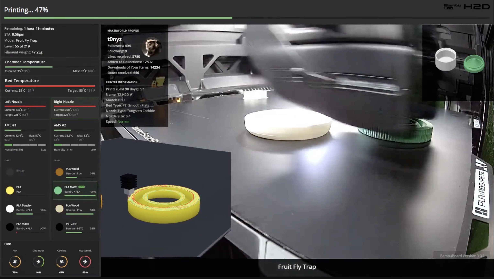

<div align="center">

# BambuBoard

**OBS dashboard widgets for Bambu Lab printers.**
Live print stats overlays designed for streamers — drop a scene file into OBS Studio and you have a polished, real-time print dashboard on stream.

<br>

[](https://github.com/t0nyz0/BambuBoard/releases)
[](LICENSE)
[](https://github.com/t0nyz0/BambuBoard/pkgs/container/bambuboard)
[](https://github.com/t0nyz0/BambuBoard/actions/workflows/docker-publish.yml)
[](https://github.com/t0nyz0/BambuBoard/stargazers)

**Setup → Connect → Layout → Go Live.** Four steps, signposted in the app (Connect lives on the Setup page).

[Quickstart](#quickstart--docker-recommended) · [Screenshots](#screenshots) · [Supported printers](#supported-printers) · [Widget catalog](#widget-catalog) · [Troubleshooting](#troubleshooting)

</div>

---

## Why v3? (the short story)

BambuBoard started as a dashboard for OBS browser-source widgets. Over time v2 grew into a full multi-printer management app — useful, but a different product. **v3.0 returns BambuBoard to its core:** a polished single-printer dashboard built around streaming overlays, with a guided setup flow, a visual scene-layout editor, and one-click export to OBS.

- **Want streaming widgets, a clean overlay, and quick OBS import?** You're in the right place.
- **Want multi-printer fleet management?** Stay on **v2.x** — checkout the [`v2.0.1` tag](https://github.com/t0nyz0/BambuBoard/tree/v2.0.1) (`git checkout v2.0.1`) or pull the matching Docker image: `ghcr.io/t0nyz0/bambuboard:2.0.1`. v3 is intentionally single-printer.

Everything else from v2 (LAN-only operation, Bambu Cloud auth, all the per-widget customizations) carries over. The major addition in v3 is the **scene editor** — drag widgets around an OBS-canvas-sized preview, then save & export the scene JSON in one click.

---

## Screenshots

> **Live H2D dashboard** — chamber camera background, gcode toolpath widget, dual nozzles, dual AMS, MakerWorld profile, and progress bar all composited as OBS browser sources.

<a href="screenshots/LIVE-DASHBOARD-3.0.jpg"></a>

<table>
  <tr>
    <td width="50%" valign="top">
      <h4>1. Setup</h4>
      <p>Printer credentials, connection test, and optional Bambu Cloud sign-in.</p>
      <a href="screenshots/SETUP-TAB.jpg"></a>
    </td>
    <td width="50%" valign="top">
      <h4>2. Layout</h4>
      <p>Visual scene editor with live widget previews on a 1920×1080 OBS canvas. Drag, resize, snap to grid.</p>
      <a href="screenshots/LAYOUT-TAB.jpg"></a>
    </td>
  </tr>
  <tr>
    <td width="50%" valign="top">
      <h4>3. Go Live</h4>
      <p>Publish your layout and point <strong>one</strong> OBS Browser Source at <code>/live</code>. No per-widget sources, no camera/SDP setup.</p>
      <a href="screenshots/EXPORT-TAB.jpg"></a>
    </td>
    <td width="50%" valign="top">
      <h4>4. Dashboard</h4>
      <p>Live print monitor — bed, chamber, nozzles, AMS, fans, MakerWorld profile. Capability-driven.</p>
      <a href="screenshots/DASHBOARD-TAB.jpg"></a>
    </td>
  </tr>
</table>

---

## Highlights

- **Drop-in OBS scene** — pre-built H2D and X1-family scene templates with widget positions, sizes, and themes already tuned for stream overlays. Download, import, done.
- **Visual scene editor** — drag widgets onto a 1920×1080 preview canvas. Snap to grid. Multi-select. Undo/redo. Live previews driven by your real telemetry. New OBS-style Layers panel for drag-to-reorder z-stacking.
- **Live gcode toolpath widget** *(experimental / beta)* — three.js widget that fetches the active print's gcode over FTPS, parses it, and renders the toolpath in real time with a stylized hotend tracing the active layer. Multi-color prints get per-tool AMS colors. Adaptive speed calibration keeps the simulation locked to the printer's reported `mc_percent` even through filament swaps. Single-color prints work great; multi-color/multi-object timing on complex prints can still drift — open an issue if you hit a case that's clearly off.
- **MQTT auto-detection** — printer model auto-detected on connect; no need to remember whether you have an X1C or P1S. Mirrors the [ha-bambulab](https://github.com/greghesp/ha-bambulab) detection logic.
- **AMS drying indicator** — `AMS 2 Pro` and `AMS HT` units get a live "DRYING · 60° · 11h" pill with an animated fan icon when actively heating filament.
- **Active tray + active nozzle highlights** — the currently-feeding filament tray and the currently-extruding nozzle get a green left-edge accent + soft tint while printing.
- **Bambu Cloud (optional)** — sign in via paste-token (Cloudflare-resilient) or email + verification code to populate MakerWorld profile + model image widgets.
- **LAN-only operation** — fully functional without any cloud dependency; all assets bundled locally (no CDN calls).
- **One-line Docker install** — multi-arch image (`amd64` / `arm64`) auto-published to GHCR. Works on x86, Apple Silicon, Raspberry Pi, Synology NAS.

---

## Quickstart — Docker (recommended)

A single command. Multi-arch image (works on x86, Apple Silicon, Raspberry Pi):

```bash
docker run -d --name bambuboard -p 8080:8080 \
  -v $(pwd)/data:/usr/src/app/data \
  ghcr.io/t0nyz0/bambuboard:latest
```

Then open **http://localhost:8080**. The first-run setup wizard appears automatically.

For docker-compose users, see [`docker-compose.yml`](docker-compose.yml) — `docker compose up -d` and you're done.

### Synology NAS

One-command install and update for Synology NAS (or any Docker host that needs host networking):

```bash
# First time — download the update script
curl -O https://raw.githubusercontent.com/t0nyz0/BambuBoard/main/update-synology.sh
chmod +x update-synology.sh

# Run it (auto-elevates to sudo)
./update-synology.sh
```

Uses host networking so MQTT/RTSP can reach the printer without NAT config. Settings persist in a Docker volume across updates — run the same script to update and your config carries over automatically.

A [`docker-compose.synology.yml`](docker-compose.synology.yml) is also available if you prefer compose.

## Quickstart — from source

```bash
git clone https://github.com/t0nyz0/BambuBoard.git
cd BambuBoard
npm install
npm start
```

Open `http://localhost:8080`.

---

## The 4-step flow

When you open BambuBoard for the first time, you'll be guided through:

1. **Setup** (`/setup`) — Enter your printer's IP, serial number, and LAN access code. Test the connection from this page before saving.
2. **Connect** (`/setup#connect`, same page as Setup) — BambuBoard asks the printer to identify itself via MQTT. Within a few seconds you'll see "Auto-detected: H2D" (or whichever model). The "Continue to Layout →" button lights up.
3. **Layout** (`/scene-editor`) — A 1920×1080 canvas auto-loads the matching default template for your printer type. Drag widgets, resize, change themes, snap to grid. When you're happy, click **🔴 Go Live** to publish it.
4. **Go Live** (`/`) — Add **one Browser Source** in OBS pointing at `http://<your-host>:8080/live` (or use the one-click "Download OBS scene" — it's just that single source). No camera media source, no SDP. Re-publish from the editor any time and OBS updates on its own.

> **Match your OBS canvas to the scene.** Set the Browser Source size (and OBS → **Settings → Video → Base (Canvas) Resolution**) to your scene's resolution — 1920×1080 by default. `/live` scales to fit, so a mismatch just letterboxes rather than breaking.

You'll need before starting:
- The printer's **IP address** (printer screen → Settings → Network).
- The **serial number** (Settings → Device Info, or back-panel sticker).
- The **LAN access code** (Bambu Studio → Device → Access Code).

---

## Supported printers

Printer type is **auto-detected from MQTT** when BambuBoard connects — no need to remember which model you picked. The detection mirrors [ha-bambulab](https://github.com/greghesp/ha-bambulab)'s logic (matches by MQTT `product_name`, falls back to hardware version).

> **Honesty about testing:** I personally own and actively test BambuBoard against the **X1 Carbon** and **H2D**. Every other model below is a "should work" — the detection logic, capability map, and widget set were ported from ha-bambulab (which is broadly tested), but I can't physically verify the others. If something looks off on your specific printer, please open an [issue](https://github.com/t0nyz0/BambuBoard/issues) with a screenshot + the relevant chunk of `localhost:8080/data.json` and I'll fix it.

| Model | BambuBoard type | Caps | Status |
|-------|-----------------|------|--------|
| X1 Carbon | `X1C` | Chamber temp | ✅ **Tested by maintainer** |
| H2D, H2D Pro | `H2D` | Chamber temp, dual nozzle, dual AMS | ✅ **Tested by maintainer** |
| X1 | `X1` | Chamber temp | ⚠️ Should work — community feedback welcome |
| X1E | `X1C` (mapped) | Chamber temp | ⚠️ Should work — community feedback welcome |
| P1P | `P1P` | — | ⚠️ Should work — community feedback welcome |
| P1S, P2S | `P1S` | — | ⚠️ Should work — community feedback welcome |
| A1 | `A1` | Single AMS | ⚠️ Should work — community feedback welcome |
| A1 Mini | `A1M` | Single AMS | ⚠️ Should work — community feedback welcome |
| H2C, H2S, X2D | `H2D` (mapped) | Chamber temp, dual nozzle, dual AMS | ⚠️ Should work — community feedback welcome |

**AMS variants:** any printer with a heating-capable AMS (AMS 2 Pro, AMS HT) gets a live drying indicator on the AMS widget when a dry cycle is running — `dry_time`, `dry_temperature`, animated fan icon. Older AMS / AMS Lite always reports zero so the indicator stays hidden, no model gating needed.

**Multi-AMS:** all printers support up to 4 chained AMS units via the AMS Hub. Add a second AMS widget to your scene with `?ams=1` (or `?ams=2`, `?ams=3`) to target the others.

---

## What's where

```
BambuBoard/
├── src/                  Server (Node, Express)
│   ├── server.js         Bootstrap
│   ├── mqtt.js           Single-printer MQTT client + printer auto-detect
│   ├── config.js         Load / save / migrate
│   ├── routes/           api, pages, auth, obsScene, video
│   └── lib/caps.js       PRINTER_CAPS map + printerTypeFromMqtt()
├── views/                Pretty-URL HTML pages
├── public/
│   ├── css/              theme, components, hub, dashboard, setup, scene-editor
│   ├── js/               nav (with stepper), hub, dashboard, setup, scene-editor
│   ├── assets/           jQuery, Material Symbols, fonts (local — no CDNs)
│   └── widgets/          OBS browser-source widgets (each its own folder)
├── OBS_settings/
│   └── templates/        Scrubbed default scenes for each printer family
├── data/                 Runtime state (gitignored): data.json, accessToken.json, note.json, scenes/
├── scripts/              build-widget-catalog.js, etc.
├── config.json           Local config (gitignored)
└── example.config.json
```

---

## Pages

- **`/setup`** — Step 1+2: Printer config, connection check, optional Bambu Cloud auth.
- **`/scene-editor`** — Step 3: Visual scene editor. Auto-loads the matching template for your printer type. Save, Preview, or **🔴 Go Live** to publish.
- **`/`** (Live) — Step 4: the published output. Shows the `/live` URL + copy button, a one-click single-source OBS scene download, and a live preview.
- **`/live`** — the composited broadcast page itself (camera + every widget). Point one OBS Browser Source here. Renders the published scene, or a default layout if nothing's published yet.
- **`/login`** — Bambu Cloud sign-in (only used when cloud auth is enabled).

---

## Widget catalog

Every widget is a standalone HTML page you add as a Browser Source in OBS. The hub gallery shows live previews; the scene editor lets you drag them onto a canvas.

<!-- WIDGET-CATALOG-START -->
| Widget | Description | Recommended size | Params | Cap-gated |
|--------|-------------|------------------|--------|-----------|
| **AMS** (`ams`) | Combined AMS card: chamber temp + humidity bar + drying status (AMS 2 Pro / AMS HT) + 4 tray rows. Active tray gets a green left-edge accent. Defaults to AMS #1 (firmware id=1, which is the user-facing 'AMS #1' on H2D dual-AMS setups). Multi-AMS: ?ams=0\|1\|2\|3. | 400×460 | `?ams=1` | — |
| **AMS humidity / temp (legacy)** (`ams-temp`) | Standalone humidity + chamber-temp + drying readout. Superseded by the combined `ams` widget which now includes this header above the trays. Kept for back-compat with custom scenes that reference it. | 400×120 | — | — |
| **AMS #2 humidity (legacy)** (`ams-temp-2`) | Standalone humidity + chamber-temp + drying readout for the second AMS. Superseded by the combined `ams2` widget which now includes this header above the trays. Kept for back-compat with custom scenes. | 400×120 | — | `hasDualAMS` |
| **AMS #2** (`ams2`) | Combined AMS #2 card (H2D only): chamber temp + humidity + drying status + 4 tray rows. Same layout as the primary `ams` widget but reads `ams.ams[0]` (firmware id=0, which is the user-facing 'AMS #2' on H2D — Bambu's MQTT enumeration is reversed from the labeled hardware). | 400×460 | — | `hasDualAMS` |
| **Bed temperature** (`bed-temp`) | Heat-bed temp with target + progress bar. | 400×120 | — | — |
| **Chamber temperature** (`chamber-temp`) | Enclosed-chamber temperature (X1, X1C, H2D). | 400×120 | — | `hasChamberTemp` |
| **Fans** (`fans`) | All four fan speeds with animated spinning icons and circular gauge rings showing speed percentage. | 420×160 | — | — |
| **Gcode Toolpath** (`gcode-viz`) | **Experimental / beta.** Live three.js visualization of the active print's gcode, advancing layer-by-layer with a stylized hotend tracing the toolpath. Multi-color prints render per-tool AMS colors. Adaptive speed calibration keeps the sim locked to the printer's mc_percent through filament swaps. Single-color prints work great; multi-object timing on complex prints can still drift. | 640×640 | — | — |
| **Model image** (`model-image`) | Preview image of the current model (requires Bambu Cloud auth for live MakerWorld images). | 400×300 | — | — |
| **Notes / footer** (`notes`) | Auto-updates with the model name each print; can be manually overridden from the dashboard. | 600×40 | — | — |
| **Nozzle info** (`nozzle-info`) | Nozzle type, size, current speed level. | 400×120 | — | — |
| **Nozzle temperature** (`nozzle-temp`) | Nozzle temperature with current/target and progress bar. Use ?nozzle=0 (right, default) or ?nozzle=1 (left) for dual-nozzle printers. | 400×120 | `?nozzle=0` | — |
| **Left nozzle temperature** (`nozzle-temp-2`) | Left nozzle temperature (H2D/dual-nozzle). Legacy widget — equivalent to nozzle-temp/?nozzle=1. | 400×120 | — | `hasDualNozzle` |
| **Print info** (`print-info`) | Total prints, model name, weight, nozzle/bed. | 400×160 | — | — |
| **Printer info** (`printer-info`) | Printer name, model, serial, IP. | 400×140 | — | — |
| **MakerWorld profile** (`profile-info`) | Followers, downloads, and stats from your MakerWorld profile (requires Bambu Cloud auth). | 400×180 | — | — |
| **Progress** (`progress-info`) | Print progress bar with status text and percentage. | 600×80 | — | — |
| **Version stamp** (`version`) | Shows BambuBoard version in a corner. | 200×30 | — | — |
| **Wi-Fi signal** (`wifi`) | Wireless signal strength. | 200×80 | — | — |

_19 widgets — generated by `scripts/build-widget-catalog.js`._
<!-- WIDGET-CATALOG-END -->

Regenerate this table after adding/changing widgets:
```bash
npm run build:widget-catalog
```

Cap-gated widgets are greyed out in the hub gallery for incompatible printer types (e.g. `chamber-temp` is hidden on P1P which has no chamber).

---

## URL parameters

Every widget supports query-string customization via `_customizer.js`:

- `?theme=dark|light|transparent` — color scheme
- `?accent=#51a34f` — accent color (hex)
- `?fontSize=14` — base font size in px
- `?title=My title` — override the widget's title text
- `?pad=8` — extra body padding in px

Plus widget-specific params (see catalog above) — e.g. `?ams=2` to point an AMS widget at the third unit.

---

## OBS scene templates

Two pre-built scenes are included, scrubbed of personal info:

- **`default-x1`** — X1, X1 Carbon, P1P, P1S, A1, A1 Mini (single nozzle, single AMS layout).
- **`default-h2d`** — H2D / H2D Pro (dual nozzle + dual AMS layout).

The scene editor auto-loads the right one based on the connected printer's type. You can also download the raw JSON from the Export page and import it directly into OBS.

Both templates use the **combined AMS widget** (chamber temp + humidity + drying status + tray contents in one card) and a uniform 3px-gap right rail: Chamber Temp → Bed Temp → Nozzle(s) → AMS → Fans, all top-to-bottom flush. Active nozzle and active filament tray are highlighted with a green left-edge accent + soft tint while printing.

---

## Bambu Cloud auth (optional)

Off by default. Enable in `/setup` to populate the `profile-info` and `model-image` widgets with live MakerWorld data. Sign-in flow uses email + verification code (and MFA if enabled on your Bambu account). Tokens are cached in `data/accessToken.json` (gitignored). LAN-only operation does not require this.

---

## Running offline / on a LAN

All assets (jQuery, Material Symbols, fonts) are bundled locally — no external CDN dependencies. The dashboard server only needs LAN access to your printer's MQTT port (8883 by default).

---

## Migrating from older versions

The first boot of v3 detects and migrates two legacy config shapes:

- **Old single-printer H2D fork** (flat `BambuBoard_printerURL` etc.) → new `printer` object with `type: "H2D"`.
- **Old multi-printer BambuBoard v2** (`printers[]` array) → first printer is kept; the rest are dropped with a warning.

> **WARNING — multi-printer users:** v3 is intentionally single-printer. Upgrading from v2 with more than one printer in your config will silently drop everything except the first entry on first boot. If you rely on multi-printer support, **stay on v2** — use the [v2.0.1 release](https://github.com/t0nyz0/BambuBoard/tree/v2.0.1) (`git checkout v2.0.1`) or pull `ghcr.io/t0nyz0/bambuboard:2.0.1`. A pre-merge backup is saved as `config.json.pre-merge-*-{timestamp}.bak` so the original config is recoverable.

Both produce a `config.json.pre-merge-*-{timestamp}.bak` backup before overwriting. Legacy runtime files (`accessToken.json`, `note.json`, `public/data.json`) at the repo root are auto-moved into `data/` on first boot.

---

## Troubleshooting

- **"Test connection" fails** — verify the IP, port (8883), serial number, and access code. The printer must be on the same LAN.
- **No data appearing on dashboard** — check the printer's "LAN Mode Liveview" setting is enabled (Settings → General). Also check the "Connect" panel on `/setup` — it should show "MQTT: ✓ Connected" within 3-5s.
- **Wrong printer type detected** — BambuBoard auto-detects from MQTT and overwrites `config.printer.type` accordingly. If detection picks the wrong model (rare — usually means custom firmware), set `BAMBUBOARD_PRINTER_TYPE=X1` (or whatever) as an env var; that always wins.
- **Camera is black / "Camera off"** — BambuBoard now renders the camera itself (no OBS media source, no SDP, no Bambu Studio). Enable **LAN Mode Liveview** on the printer touchscreen: Settings → Network → LAN Only Liveview → ON, then reboot (firmware 01.06+ for X1-class/H2D). The camera widget shows these exact steps when the feed is unavailable. P1/A1 use a different camera protocol the relay doesn't speak yet.
- **OBS shows nothing at `/live`** — make sure the BambuBoard server is running and the Browser Source URL points at `http://<your-host>:8080/live` (not `localhost` if OBS is on another machine). Publish a scene with **🔴 Go Live**, or `/live` falls back to the default layout.

---

## Development

```bash
npm install
npm start                         # uses ./data/config.json (or env overrides)
BAMBUBOARD_LOGGING=true npm start > /tmp/bb.log 2>&1 &
tail -f /tmp/bb.log               # verbose MQTT trace
```

Useful npm scripts:

| Script | What it does |
|---|---|
| `npm start` | Start the server on port 8080 (or `BAMBUBOARD_PORT`). |
| `npm run build:widget-catalog` | Regenerate the widget catalog table in this README from each widget's `widget.json`. Run after adding/changing widgets. |

---

## Contributing

Issues, bug reports, and pull requests are welcome — especially for printer models I don't own (P1P / P1S / A1 / A1 Mini / X1 / X1E). When filing a bug, a screenshot + the relevant chunk of `localhost:8080/data.json` makes triage 10× faster.

---

## Acknowledgements

- [**ha-bambulab**](https://github.com/greghesp/ha-bambulab) — the Home Assistant integration BambuBoard's printer-detection logic, stage-code map, AMS drying-state model, and packed-temperature decoding are all ported / verified against. Thank you to that project's maintainers — they did the hard reverse-engineering work.
- [**Bambu Lab**](https://bambulab.com/) — for making fantastic printers and an MQTT-friendly firmware.
- [**OBS Studio**](https://obsproject.com/) — for the browser-source plugin that makes any of this possible.

---

## License

[MIT](LICENSE) © [t0nyz0](https://github.com/t0nyz0)

<div align="center">

If you found BambuBoard useful, a star on the repo helps others discover it.

</div>
