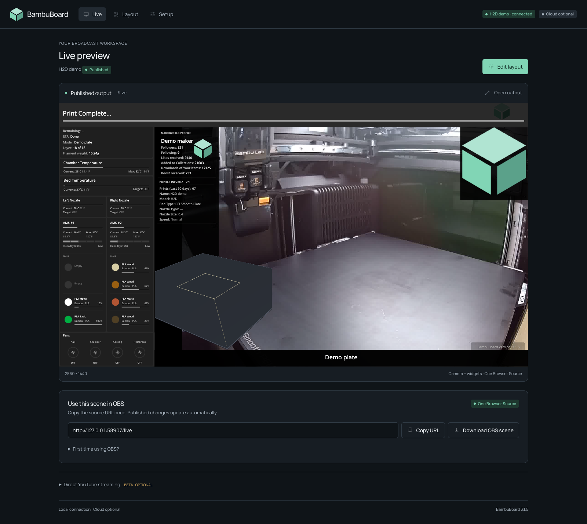
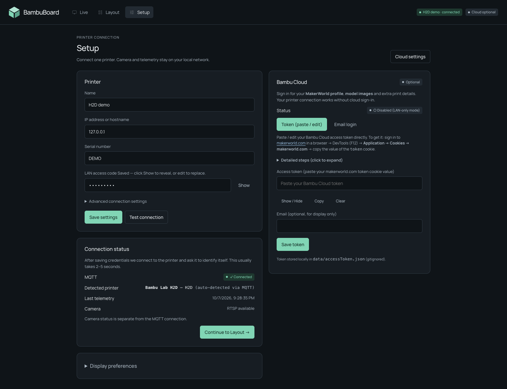
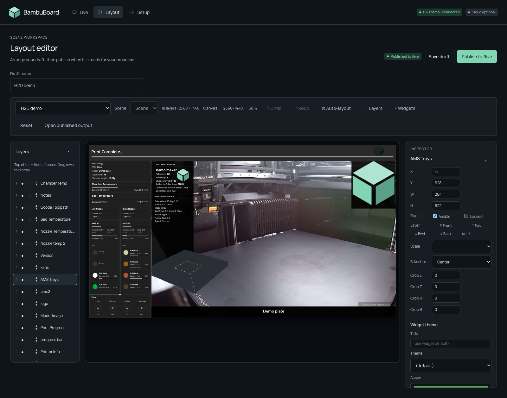

<div align="center">


# BambuBoard

**Live print overlays for Bambu Lab printers, built for streamers.**
Design a dashboard once, click **Publish to /live**, and add a *single* Browser Source to OBS — camera and all widgets composited into one page. No scene import, no SDP file, no Bambu Studio.

<br>

[](https://github.com/t0nyz0/BambuBoard/releases)
[](LICENSE)
[](https://github.com/t0nyz0/BambuBoard/pkgs/container/bambuboard)
[](https://github.com/t0nyz0/BambuBoard/actions/workflows/docker-publish.yml)
[](docs/qa-3.3.0.md)
[](https://github.com/t0nyz0/BambuBoard/stargazers)

**Setup → Connect → Layout → Publish.** One printer per BambuBoard instance.

[Quickstart](#quickstart) · [Screenshots](#screenshots) · [Supported printers](#supported-printers) · [Widget catalog](#widget-catalog) · [Troubleshooting](#troubleshooting)

</div>

---

## Screenshots

> **Live workspace** — the published camera and widgets come first. OBS setup sits below the preview, and optional direct YouTube streaming stays collapsed at the bottom.

<a href="screenshots/STUDIO-LIVE.png"></a>

<table>
  <tr>
    <td width="50%" valign="top">
      <h4>Setup</h4>
      <p>Printer connection and an always-visible Bambu Cloud card, with sign-in status and controls.</p>
      <a href="screenshots/STUDIO-SETUP.png"></a>
    </td>
    <td width="50%" valign="top">
      <h4>Layout editor</h4>
      <p>Arrange widgets using the canvas, Layers panel and docked inspector. Save a draft, then Publish to /live when it is ready.</p>
      <a href="screenshots/STUDIO-LAYOUT.png"></a>
    </td>
  </tr>
</table>

Screenshots show the actual app in an isolated demo installation, with sample telemetry, sample cloud responses and a recorded H2D camera feed. Saved widget themes remain independent of the app theme. [View the mobile Live page](screenshots/STUDIO-MOBILE.png).

---

## What it does

- **Design and publish an overlay.** Arrange widgets with drag/resize, Layers, grid snapping and Undo/Redo. **Save draft** preserves your edits; **Publish to /live** updates the broadcast. Draft edits and deletions leave the published snapshot intact.
- **Show printer telemetry and camera together.** Progress, temperatures, fans, AMS trays and reported drying status sit alongside a camera feed relayed by BambuBoard. Camera transport is selected from the printer's detected type.
- **Preview the sliced toolpath.** The experimental G-code widget downloads the current print over FTPS, validates sliced archives and offers retries, diagnostics and manual file recovery. Nozzle motion is estimated from layers/progress and G-code timing; it can drift during complex or multi-color prints.
- **Run on your LAN.** App scripts, fonts and other assets are bundled locally. Core telemetry, camera and toolpath features do not require cloud sign-in. Optional Bambu Cloud data supplies MakerWorld content and extra print details.
- **Stream directly to YouTube (beta).** The optional section at the bottom of Live can render `/live` on the server, continuing after you close the controls, or share a browser tab with optional tab audio. Choose quality, check setup, monitor encoding and download redacted diagnostics. Browser sharing needs HTTPS or localhost; server capture works from an HTTP LAN address. [Streaming setup and limitations](docs/youtube-streaming.md).

## Quickstart

### Docker (recommended)

Images are published for `linux/amd64` and `linux/arm64`. The Docker host must be able to reach your printer on the LAN.

```bash
docker run -d --name bambuboard --restart unless-stopped -p 8080:8080 \
  -v "$(pwd)/data:/usr/src/app/data" \
  ghcr.io/t0nyz0/bambuboard:latest
```

Open **http://localhost:8080**, or **http://<your-host-ip>:8080** when Docker runs on another machine. An unconfigured installation opens Setup automatically. Settings, scenes and cached files persist in the mounted `data` directory; back it up before upgrades.

[`docker-compose.yml`](docker-compose.yml) is an alternative for a repository checkout and builds the image locally. Edit or remove its example `BAMBUBOARD_PRINTER_*` environment settings before running `docker compose up -d`: populated overrides replace values saved through Setup when the app starts. Keep the included `OBS_settings` directory when using its template mount.

### Synology NAS

The [Synology Compose file](docker-compose.synology.yml) pulls the published image, uses host networking and mounts `~/bambuboard-data`. Save the file on your NAS, then run:

```bash
docker compose -f docker-compose.synology.yml pull
docker compose -f docker-compose.synology.yml up -d
```

Alternatively, use the [install/update script](update-synology.sh):

```bash
curl -O https://raw.githubusercontent.com/t0nyz0/BambuBoard/main/update-synology.sh
chmod +x update-synology.sh
./update-synology.sh
```

The script elevates with `sudo`, pulls `latest` and replaces the `bambuboard` container. Its bind mount is `$HOME/bambuboard-data` **after elevation**, usually `/root/bambuboard-data`; it prints the actual path. Compose resolves `~` from the account running Compose. For an existing installation, retain its current data mount when choosing either method so your settings and scenes carry over. Open **http://<your-nas-ip>:8080**.

### From source

Use **Node.js 24** (see [`.nvmrc`](.nvmrc)) and **npm 11 or newer**:

```bash
git clone https://github.com/t0nyz0/BambuBoard.git
cd BambuBoard
npm ci
npm start
```

Open **http://localhost:8080**. Source installs use `ffmpeg-static`, or an explicit `FFMPEG_BIN` path; Docker includes FFmpeg and Chromium. Server YouTube capture also needs Chromium or Chrome on source installs; see [streaming setup](docs/youtube-streaming.md#requirements).

## Setup, layout and OBS

Have your printer's **IP address, serial number and LAN access code** ready. These are available through the printer's settings and Bambu Studio; menu labels vary by model and firmware.

1. **Setup** (`/setup`) — Enter the credentials, save settings and test the connection. MQTT port and display preferences are in secondary sections.
2. **Connect** (`/setup#connect`) — Check MQTT, telemetry and camera status. The app requests the printer's model over MQTT; **Continue to Layout →** becomes available once it is connected and identified.
3. **Layout** (`/scene-editor`) — Open a saved draft or start with a default template. Arrange and style your widgets, then **Publish to /live** when ready.
4. **Live workspace** (`/`) — Preview the published output and copy its URL. Add one OBS Browser Source pointing at **`http://<your-host>:8080/live`**, or use **Download OBS scene** and import the exported collection into OBS.

**`/live` is the broadcast output; `/` is the management page.** The broadcast renders the published snapshot, falling back to a matching default template before the first publication. Re-publish to update it automatically. If OBS runs on another machine, use the BambuBoard host's address rather than `localhost`.

Match the Browser Source dimensions and OBS **Settings → Video → Base (Canvas) Resolution** to the published scene size shown under Live preview. The OBS download includes that size, including custom resolutions. A differently sized browser viewport scales the scene to fit and may letterbox. Use `/live?transparent=1` to make the page background transparent; individual widget and scene backgrounds still apply.

Default templates are layout starters in [`OBS_settings/templates`](OBS_settings/templates): `default-x1` for single-nozzle layouts and `default-h2d` for the H2D-class dual layout. The editor chooses by detected type and falls back to `default-x1`. Customize the starter to match your actual hardware, including its AMS selection.

## Supported printers

Detection matches MQTT product names, then falls back to hardware/project identifiers. The [capability map](src/lib/caps.js), based on [ha-bambulab](https://github.com/greghesp/ha-bambulab), controls widget availability and camera transport.

The maintainer owns and tests **X1 Carbon and H2D**. Other entries are code mappings that need community hardware feedback; a recognized model does not establish that every widget works on its firmware. The current G-code changes have a read-only physical H2D download and local rendering check; affected H2C firmware and actual OBS still need confirmation. See the [QA record](docs/qa-studio-refresh.md) and [G-code verification](docs/gcode-resilience.md#verification) for the scope of testing.

| Printer | BambuBoard type | Current coverage |
|---|---|---|
| X1 Carbon | `X1C` | Maintainer-tested hardware |
| H2D | `H2D` | Maintainer-tested hardware |
| X1 | `X1` | Dedicated capability entry; community feedback welcome |
| P1P / P1S | `P1P` / `P1S` | Dedicated capability entries; community feedback welcome |
| P2S | `P2S` | Dedicated capability entry; community feedback welcome |
| A1 / A1 Mini | `A1` / `A1M` | Dedicated capability entries; community feedback welcome |
| X1E | `X1C` | Shared fallback; no dedicated X1E capability entry |
| H2D Pro / H2C / H2S / X2D | `H2D` | Shared fallback; no dedicated capability entries |

Fallback mappings reuse another model's widget gates and build dimensions. They can differ from the actual hardware, so check the selected widgets and layout rather than assuming all H2D features apply.

**AMS selection:** available units depend on the printer, AMS hardware and firmware. The `ams` widget uses the array index in `print.ams.ams`, starting at 0; this may differ from physical labels. Its default is **1**, used by the H2D starter. For a single AMS, set **`?ams=0`**. Add copies with the appropriate indexes for additional reported units. Drying indicators appear when telemetry reports a positive `dry_time`; unsupported or absent readings do not imply a dry cycle.

## Widget catalog

Each widget is a standalone page at `/widgets/<slug>/`. Add it in the Layout editor to include it in `/live`, or use its URL as an individual OBS Browser Source. Availability is based on the detected type; capability-gated widgets are disabled in the editor for incompatible types.

<!-- WIDGET-CATALOG-START -->
| Widget | Description | Recommended size | Params | Cap-gated |
|--------|-------------|------------------|--------|-----------|
| **AMS** (`ams`) | AMS temperature, humidity, reported drying status and four filament trays, with active-tray highlighting. Select a telemetry array entry with ?ams=N; the default is 1. Use ?ams=0 for a single AMS. | 400×460 | `?ams=1` | — |
| **AMS humidity / temp (legacy)** (`ams-temp`) | Legacy standalone AMS humidity, temperature and reported drying status. These readouts are also included in `ams`. | 400×120 | — | — |
| **AMS #2 humidity (legacy)** (`ams-temp-2`) | Legacy companion AMS humidity, temperature and reported drying status. These readouts are also included in `ams2`. | 400×120 | — | `hasDualAMS` |
| **AMS #2** (`ams2`) | Legacy companion AMS card for H2D-class layouts. Shows temperature, humidity, reported drying status and four trays from telemetry array entry 0. Use the configurable `ams` widget to select other entries. | 400×460 | — | `hasDualAMS` |
| **Bed temperature** (`bed-temp`) | Heat-bed temp with target + progress bar. | 400×120 | — | — |
| **Live camera** (`camera`) | Printer camera relayed into the browser. Selects RTSP or the chamber-image transport from the detected printer type. Requires reachable LAN camera access; RTSP liveview must be enabled on the printer. | 640×360 | — | — |
| **Chamber temperature** (`chamber-temp`) | Reported chamber temperature, shown for printer types with the chamber-temperature capability. | 400×120 | — | `hasChamberTemp` |
| **Fans** (`fans`) | Auxiliary, chamber, cooling and heatbreak fan gauges from reported telemetry. Available readings depend on the printer. | 420×160 | — | — |
| **Gcode Toolpath** (`gcode-viz`) | Experimental 3D toolpath from the current print's sliced G-code, downloaded over FTPS or loaded manually. Uses reported layers/progress and estimated timing, with bounded retries and downloadable diagnostics. Requires WebGL 2; simulated nozzle motion can drift. | 640×640 | — | — |
| **Model image** (`model-image`) | Preview image of the current model (requires Bambu Cloud auth for live MakerWorld images). | 400×300 | — | — |
| **Notes / footer** (`notes`) | Auto-updates with the model name each print; supports a manual text override (via the /api/note endpoint). | 600×40 | — | — |
| **Nozzle info** (`nozzle-info`) | Nozzle type, size, current speed level. | 400×120 | — | — |
| **Nozzle temperature** (`nozzle-temp`) | Nozzle temperature with current/target and progress bar. Use ?nozzle=0 (right, default) or ?nozzle=1 (left) for dual-nozzle printers. | 400×120 | `?nozzle=0` | — |
| **Left nozzle temperature** (`nozzle-temp-2`) | Left nozzle temperature (H2D/dual-nozzle). Legacy widget — equivalent to nozzle-temp/?nozzle=1. | 400×120 | — | `hasDualNozzle` |
| **Print info** (`print-info`) | Remaining time, estimated finish time, model name and layer count from telemetry. Filament weight is populated from Bambu Cloud when available. | 400×160 | — | — |
| **Printer info** (`printer-info`) | Nozzle type/size and print speed from telemetry, plus printer name, model, bed type and recent print count when Bambu Cloud data is available. | 400×140 | — | — |
| **MakerWorld profile** (`profile-info`) | Followers, downloads, and stats from your MakerWorld profile (requires Bambu Cloud auth). | 400×180 | — | — |
| **Progress** (`progress-info`) | Print progress bar with status text and percentage. | 600×80 | — | — |
| **Version stamp** (`version`) | Shows BambuBoard version in a corner. | 200×30 | — | — |
| **Wi-Fi signal** (`wifi`) | Wireless signal strength. | 200×80 | — | — |

_20 widgets — generated by `scripts/build-widget-catalog.js`._
<!-- WIDGET-CATALOG-END -->

### URL parameters

The shared customizer accepts these parameters. Appearance depends on the widget: title overrides require a title element, and full-frame camera/G-code widgets manage their own backgrounds.

| Parameter | Meaning |
|---|---|
| `theme=dark`, `light` or `transparent` | Widget color scheme |
| `accent=51a34f` | Hex accent color **without `#`** |
| `fontSize=14` | Base font size in pixels |
| `title=My%20title` | Override an existing widget title |
| `pad=8` | Body padding in pixels, clamped to 0–64 |

Combine parameters with `&`, for example `/widgets/ams/?ams=0&theme=dark&accent=51a34f`. Widget-specific parameters are listed in the catalog. Saved widget themes are independent of the management app's theme.

## Bambu Cloud (optional)

Cloud sign-in is off by default. In **Setup**, the Bambu Cloud card appears alongside printer settings on desktop; the **Cloud settings** shortcut jumps to it on smaller screens. `/login` redirects to this card.

Choose **Email code**, enter your Bambu account email, then enter the latest six-digit code Bambu sends you. The form guides you through MFA if required and shows when you can resend a code. If Bambu blocks sign-in, choose **Paste token** for browser-specific MakerWorld instructions. BambuBoard verifies pasted tokens before saving them; rejected tokens and temporary service failures keep your existing sign-in intact.

Successful sign-in enables cloud features and stores the token locally in `data/accessToken.json` (gitignored). **Check connection** verifies a saved sign-in; **Sign out** clears it and disables cloud features.

MakerWorld profile/model images, filament weight and some printer/history fields require cloud data. Telemetry widgets, the camera and FTPS toolpaths use your LAN credentials. Leave cloud sign-in disabled for LAN operation.

## Network access

Allow the BambuBoard host to reach the printer on the ports used by your features:

| Feature | Printer connection |
|---|---|
| Telemetry | TLS MQTT, **8883** by default; configurable in Setup |
| RTSP camera | TLS RTSP, **322** for types mapped to X1/X1C/H2D/P2S |
| Chamber-image camera | TLS image stream, **6000** for P1/A1-class types |
| G-code download | Implicit TLS FTPS, **990**, plus the printer's negotiated passive data ports |

The viewer/OBS connects to BambuBoard on **8080** by default. MQTT success alone does not verify camera or file access. The Synology examples use host networking; the standard Docker example uses a bridge with port 8080 published. Cloud widgets need internet access; YouTube streaming uses outbound encrypted RTMPS on **443**. App assets have no CDN dependency, though custom remote sources and cloud content can still make external requests.

## Troubleshooting

- **Connection test fails or widgets have no data:** check the IP, MQTT port, serial number and LAN access code in Setup. Confirm network reachability from the BambuBoard host and look at the Connect panel's telemetry status. Enable **Verbose logging** in Setup and inspect `docker logs bambuboard` (or the source server's terminal) for connection errors.
- **Wrong printer type:** check the detected model on Setup and [current mappings](src/lib/caps.js). `BAMBUBOARD_PRINTER_TYPE` supplies the startup type; MQTT auto-detection can replace it. Report a mismatched model with its MQTT module information rather than relying on the environment variable to force a permanent override.
- **Camera is black or unavailable:** check camera status separately from MQTT. On RTSP models, enable the printer's LAN liveview option where available and follow the widget's hint; menu names and firmware requirements vary. Verify port 322 and the server's FFmpeg relay. P1/A1-class types use port 6000 and the LAN access code instead.
- **OBS shows nothing:** use `/live`, confirm the host address is reachable from the OBS machine, and publish a scene. Match the source dimensions to the canvas. Inspect `/live` in a browser on that machine to check the same output.
- **AMS is empty or shows the wrong unit:** check `print.ams.ams` in `/data.json` and set the widget's `ams` parameter. A single unit needs `?ams=0`; the primary widget defaults to 1. This selects an array position, not a universal physical AMS number.
- **G-code cannot load:** open `/widgets/gcode-viz/?debug=1` to see the reason. Use **Retry now** and **Download diagnostics**; automatic retries are bounded to five attempts. Check port 990 and passive data access. Some firmware does not expose internal cloud-job files over FTPS. **Load sliced file** accepts the exact sliced `.gcode.3mf` / `.3mf` or `.gcode` for the current print; an unsliced model project has no toolpath. It also updates the cache for other viewers. Rendering requires WebGL 2 and is subject to file-size/line limits. See [G-code troubleshooting, recovery and protocol research](docs/gcode-resilience.md) for detailed error meanings and bounds.

## Migrating from older versions

**v3 is single-printer.** If you need the older multi-printer app, the [`v2.0.1` source tag](https://github.com/t0nyz0/BambuBoard/tree/v2.0.1) remains available.

On first boot, legacy flat H2D settings are converted to the `printer` object. For a legacy `printers[]` array, migration keeps the **first entry with a non-placeholder serial number** (or the first entry if none qualifies), warns in the server log and removes other printers from the active configuration. A backup of the original is stored in `data/config.json.pre-merge-<reason>-<timestamp>.bak` before conversion.

With the default data directory, legacy root-level `config.json`, `accessToken.json`, `note.json` and `public/data.json` are moved into `data` when their destinations do not already exist. An explicit `BAMBUBOARD_DATA_DIR` disables that root-file migration. Back up the whole persistent data directory before upgrading.

## Development

The server is plain Node/Express in [`src`](src), the management pages are in [`views`](views), and each standalone widget is in [`public/widgets`](public/widgets). Keep the server [capability map](src/lib/caps.js) and its [browser mirror](public/js/caps.js) in sync. Commit `package-lock.json` with dependency changes and use `npm ci` for repeatable installs.

`BAMBUBOARD_DATA_DIR=/absolute/path` isolates runtime state; the default is the repository's `data` directory. It holds configuration, telemetry, cloud tokens, notes, drafts (`scenes/`), the published snapshot (`active-scene.json`), toolpaths (`gcode-cache/`) and the latest redacted download/stream reports (`gcode-diagnostics.json`, `stream-diagnostics.json`). None belongs in Git. Existing active scene pointers are snapshotted at startup without rewriting the draft.

Set `BAMBUBOARD_PUBLIC_URL=https://board.example.com` to choose the origin used by OBS exports. Otherwise exports honor forwarded host/protocol headers. Docker removes npm/npx/Yarn after installation; rebuild the image for dependency changes rather than installing packages in a running container.

| Command | Purpose |
|---|---|
| `npm start` | Start the server; `PORT` / `BAMBUBOARD_HTTP_PORT` can change port 8080. |
| `npm run check` | Check server, app, widget and test JavaScript syntax. |
| `npm test` | Run server/integration tests with local MQTT, FTPS, camera, cloud and RTMP fixtures. |
| `npm test -- --update-badge` | Update the README server-test count after a successful run. |
| `npm run test:browser` | Check responsive pages, keyboard controls and all widgets. |
| `npm run test:gcode-browser` | Check HTTP → FTPS → archive → WebGL, recovery, stale jobs and renderer failures. |
| `npm run test:stream-browser` | Check capture → relay → local RTMP, retries, cancellation, server controls, audio fallback and streaming accessibility. |
| `npm run test:ui` | Check editor/publication regressions, widget transparency and management-page accessibility. |
| `npm run test:cloud` | Check email/code/MFA and token sign-in through the real local API and saved state, with simulated Bambu responses; covers resend, retries, account replacement and sign-out. |
| `node scripts/capture-readme.js` | Capture Live, Layout, Setup and mobile screenshots with isolated demo data. [Fixture options](docs/qa-studio-refresh.md#screenshots-and-safe-fixtures). |
| `npm run build:vendor` | Regenerate bundled local assets from locked packages. |
| `npm run build:widget-catalog` | Print the catalog from `widget.json` files; replace the README content between the catalog markers with that output. |
| `node scripts/ftp-test.js` | Read-only current-print FTPS check with redacted JSON output. Also available as `docker exec bambuboard node scripts/ftp-test.js`. |

Install Chromium for browser checks with `npx playwright install chromium`. To run management UI checks across all three engines:

```bash
npx playwright install --with-deps chromium firefox webkit
BB_BROWSERS=chromium,firefox,webkit npm run test:ui
BB_BROWSERS=chromium,firefox,webkit npm run test:cloud
```

The **server tests** badge counts `npm test` cases and is checked against the actual runner total. The **build** badge tracks the main Docker workflow, which requires server tests, browser/UI checks and both container architectures before publishing. [Release QA](docs/qa-3.3.0.md), [Studio QA](docs/qa-studio-refresh.md), [G-code QA](docs/gcode-resilience.md#verification) and [YouTube QA](docs/youtube-streaming.md#verification) describe fixture coverage and hardware limitations.

## Contributing

[Issues](https://github.com/t0nyz0/BambuBoard/issues) and pull requests are welcome, especially hardware feedback for additional printer models. Include the model, firmware, app version, a screenshot and the relevant telemetry fields. For toolpath failures, attach **Download diagnostics** output; it redacts connection secrets. Review anything you share for private filenames, account data or credentials.

## Acknowledgements and license

Thanks to [ha-bambulab](https://github.com/greghesp/ha-bambulab) for protocol/detection work, [Bambu Lab](https://bambulab.com/) for the printers, and [OBS Studio](https://obsproject.com/) for browser sources. [G-code research credits](docs/gcode-resilience.md#protocol-and-storage-research) link the additional source projects used for file-transfer improvements.

[MIT](LICENSE) © [t0nyz0](https://github.com/t0nyz0)
