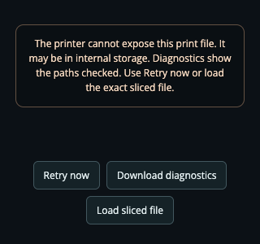

# Gcode Toolpath reliability and troubleshooting

The widget downloads the current print's sliced file, extracts its plate and renders the toolpath locally. MQTT supplies job metadata and layer progress; FTPS is a separate connection. A working camera or progress widget does not prove that the printer's file service is reachable.

## Recover a failed preview

1. Open `http://<bambuboard-host>:8080/widgets/gcode-viz/?debug=1` directly. A failure displays its reason rather than an indefinite loading spinner.
2. Use **Download diagnostics**. The JSON includes the widget timeline, renderer/browser information and the last server attempt, with stages, paths checked, reply/error codes, sizes and timing. The server also stores the last report in `data/gcode-diagnostics.json` and logs failures to Docker output. LAN access codes and signed cloud URLs are excluded. Job filenames remain in the report.
3. Correct the address/access code in Setup or make file transfer reachable, then use **Retry now**. The widget makes at most five automatic attempts per job. Server cooldowns prevent multiple widgets from repeatedly opening connections to the same failing printer.
4. If the printer cannot expose its sliced file, use **Load sliced file** with the exact sliced `.3mf` or `.gcode` used for this print. A design-only 3MF has no toolpath. The file is checked and saved under this print's cache identity; other widgets can then retrieve it. A different print or a reprint starts a new identity. A mismatched plate or bad upload preserves the existing valid cache.

For a terminal check inside the running container:

```sh
docker exec bambuboard node scripts/ftp-test.js
```

The self-test performs only reads and uses the same downloader as the widget. It emits bounded, redacted JSON and never sends print/control commands. During idle it can check login/listing but cannot establish that an upcoming job will be downloadable.



| Failure | What to check |
| --- | --- |
| `PRINTER_NOT_CONFIGURED`, `FTPS_AUTH` | Printer address and current LAN access code in Setup. Authentication failures do not trigger automatic retries. |
| `FTPS_REFUSED`, `FTPS_DNS`, `FTPS_TIMEOUT`, `FTPS_TLS` | Address resolution, printer LAN/file-access mode, port 990 and the passive data ports between the BambuBoard host and printer. A data-channel timeout can occur after login succeeds. |
| `FILE_NOT_FOUND` | The checked paths and matching filename. A profile title can differ from its stored filename. The file may be confined to internal storage. Supply the exact sliced file or send it to accessible external storage from Bambu Studio. |
| `PLATE_NOT_FOUND`, `PLATE_AMBIGUOUS` | The printer-reported plate and available archive plates. Another plate is never substituted for a known requested plate. |
| `FILE_TRUNCATED`, `FILE_CORRUPT`, `ARCHIVE_INVALID` | Interrupted transfer, invalid ZIP/CRC or mismatched slicer MD5. Re-export the sliced plate if retrying does not resolve it. |
| Browser/renderer error | WebGL 2 and hardware acceleration in the browser/OBS; context loss; toolpath limits. Download diagnostics and use Retry now after correcting the renderer configuration. |

## Protocol and storage research

Reviewed October 7, 2026. These are primary project sources and observed issue reports, not a guarantee for every printer/firmware combination.

- [OpenBambuAPI FTPS protocol](https://github.com/Doridian/OpenBambuAPI/blob/cc383a2c96576a9f53391c879acfb8dca5c534e4/ftp.md): implicit TLS on port 990, user `bblp`, LAN access code as password. BambuBoard already used this authentication correctly.
- [ha-bambulab FTPS client and TLS contexts](https://github.com/greghesp/ha-bambulab/blob/0e027ff135a6d9265cb756d3e246747954c76722/custom_components/bambu_lab/pybambu/bambu_client.py): protected data transfers reuse the control session, and TLS 1.2 avoids the documented P2S TLS 1.3 handshake stall. The locked `basic-ftp` client already supplies session reuse and EPSV/PASV negotiation; the downloader now sets a TLS 1.2 floor and ceiling.
- [Bambuddy file lookup](https://github.com/maziggy/bambuddy/blob/505948f1143eaad54bc7e4f4eebe5ec6472d34ed/backend/app/main.py): files can be at the root rather than `/cache`, and names may use spaces, underscores or different extensions. BambuBoard now checks explicit paths, named candidates and bounded directory listings with matching names. It never chooses an unrelated newest file.
- [Bambuddy transport](https://github.com/maziggy/bambuddy/blob/505948f1143eaad54bc7e4f4eebe5ec6472d34ed/backend/app/services/bambu_ftp.py): verify expected download size and bound transfer time; a successful FTP completion alone does not establish a complete file. Some A1 firmware uses an unprotected data-channel fallback in that project. BambuBoard retains encrypted transfers; that firmware-specific downgrade is not adopted without hardware validation.
- [Official Bambu Studio 3MF implementation](https://github.com/bambulab/BambuStudio/blob/da8b44ee34dd349f2ae0df3f1cbae366df482354/src/libslic3r/Format/bbs_3mf.cpp): sliced plates are `Metadata/plate_N.gcode`, and optional `plate_N.gcode.md5` files contain the plate checksum. Plate numbers are one-based; archive entry order is not a plate identifier.
- [Bambuddy H2C storage report #2910](https://github.com/maziggy/bambuddy/issues/2910): users measured FTPS restricted to external storage and internal-file download rejection on port 6000. Its cloud fallback retrieves a thumbnail, not G-code. BambuBoard does not treat a thumbnail or listing as a downloadable toolpath and does not try undocumented port-6000 file commands.
- [BambuBoard #24](https://github.com/t0nyz0/BambuBoard/issues/24) and [#25](https://github.com/t0nyz0/BambuBoard/issues/25): H2D/H2C reports of permanent loading. No complete transport logs were supplied that prove one common hardware cause. The code audit independently reproduced weak filename/metadata handling and retry/error behavior.

## Bounds and correctness

- Each lookup has a 90-second total deadline, 15-second socket inactivity limit, and at most one fresh-session retry for transient transport/corruption failures. Login failures and missing-file sweeps fail promptly. Concurrent requests for the same job share one download; a newer print cancels obsolete work.
- Download/ZIP input: 128 MiB. Extracted G-code: 64 MiB. Archive entries: 20,000. FTP directory listing: 1 MiB. Browser preview: 24 MiB and 500,000 lines. Oversized input produces an actionable error. The parser yields between chunks; it does not repeatedly rebuild geometry while parsing.
- Reported `gcode_file`/`param` plate filenames take precedence over positive plate fields. Zero IDs do not make a print unusable. If no plate is identified, a single-plate archive can be resolved; a multi-plate archive remains ambiguous.
- SHA-256 cache filenames include printer configuration, the full job identity and a locally generated lifecycle ID. Atomic writes prevent partial snapshots/cache files. Five recent toolpaths are retained. Manual uploads cannot overwrite a newer print or poison a previously valid cache.
- MQTT reports are merged as deltas, including nested AMS/tray IDs. Starting a new lifecycle clears stale job fields and requests a full snapshot when metadata is missing. The widget keeps polling while files download, discards stale responses, pauses misleading nozzle motion on telemetry loss, and detects WebGL initialization/context failures.

## Verification

The G-code follow-up adds 15 regression groups with real TLS fixture transfers. The [combined 3.3.0 server suite](qa-3.3.0.md) has 56 tests. `npm run test:gcode-browser` covers nine end-to-end groups through the real HTTP route, FTPS fixture, archive extraction and WebGL renderer. It exercises retry exhaustion, compact error controls, log downloads, manual recovery, telemetry loss/staleness and clock skew, stale downloads and file-picker races, large/unprintable files, GPU context loss and unavailable WebGL. Long, narrow and 300 mm tall toolpaths stay inside square, portrait and wide viewports; finished prints display every parsed layer even with stage `-1`. Existing all-widget and management UI suites remain part of CI, together with both Docker architectures.

```sh
npm run check
npm test
npm run test:browser
npm run test:gcode-browser
BB_BROWSERS=chromium,firefox,webkit npm run test:ui
```

Fixtures do not validate unavailable physical printer models. The nozzle simulation uses reported layers/progress and estimated G-code timing; it is not physical nozzle-position telemetry. Multi-object/multi-color timing remains experimental. Actual OBS and affected H2C firmware require hardware confirmation before making broader compatibility claims.

A read-only physical H2D check on October 7 downloaded 715,192 bytes over TLS 1.2 and passed CRC32 plus slicer MD5 validation. The actual file replayed through the new local widget rendered all 20 parsed layers and 39,370 extrusion vertices without JavaScript errors, with the full narrow model visible after the camera fit correction. Execution was on the Mac using the running NAS app configuration; candidate code was not installed in the NAS container. An attempted NAS SSH check ended before login, so that execution path remains unverified.
