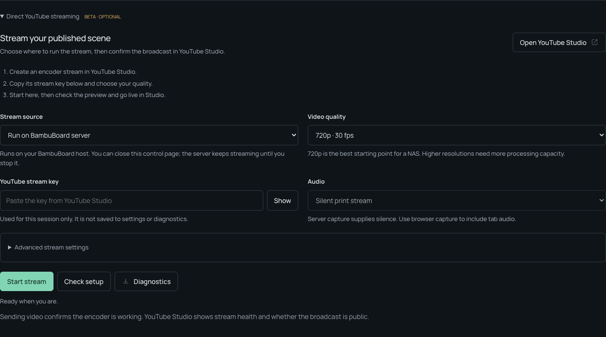

# Direct YouTube streaming

Live keeps the published preview first, OBS setup next, and this optional beta section collapsed below them. A running stream has a visible **Stop stream** button even when the section is collapsed.

## Start a stream

1. Publish the layout you want to broadcast and check `/live`, including its camera and widgets.
2. Create an encoder stream in YouTube Studio. Enable live streaming on your channel first if needed, then copy its stream key.
3. In BambuBoard → Live → **Direct YouTube streaming**, choose the source and quality. **Check setup** verifies FFmpeg, capture requirements and a trusted TLS connection to the selected ingest server; it sends no key or video and cannot validate channel permissions.
4. Paste the key and select **Start stream**. With browser capture, choose the `/live` tab in the share picker. Include tab audio in both the controls and picker if you want it.
5. Wait for **Sending video**, check the preview and health in YouTube Studio, and start the public broadcast there. Studio can also auto-start a broadcast if you configured that option.
6. Stop the encoder with **Stop stream**, and confirm the broadcast has ended in Studio. Studio's auto-stop setting affects broadcast behavior independently.

**Sending video** means FFmpeg has encoded frames and written output to its connection. It does not establish YouTube's stream health or whether viewers can see a public broadcast. BambuBoard does not sign in to YouTube or manage broadcasts through its API.



## Sources

| Source | Where it runs | Requirements and behavior |
|---|---|---|
| Run on BambuBoard server | Headless Chromium renders local `/live`; FFmpeg encodes the frames. | Works with the normal HTTP LAN control URL. Closing the controls does not stop it; reopen Live from any tab to see status or stop it. Supplies silent audio. Supports 720p/1080p at 30 output fps. |
| Share a browser tab | The desktop browser captures/encodes a tab; the BambuBoard server transcodes and relays it. | Needs HTTPS or localhost, tab-sharing permission and MediaRecorder support. Keep the control page and shared tab open. Can include shared tab audio; it never captures a microphone. Supports 720p30, 1080p30 and 1080p60. |

When no audio track is shared, the relay supplies stereo silence. Browser/OS support for sharing tab audio varies. Server capture supplies silence even when widgets or custom sources contain audio; choose browser capture or OBS when audio matters.

Server capture renders the **published** output, never an editor draft. Published changes continue to update through `/live`. Missing printer/camera/G-code data is shown as the same widget state you see in `/live`; a working encoder cannot fix a disconnected printer.

## Requirements

The Dockerfile includes Chromium, FFmpeg and CA certificates for both image architectures. Adding Chromium increases image size and runtime resource needs. Upgrade by rebuilding/pulling the image after this change is released; an older image lacks server capture.

For a source install, use an installed Chromium/Google Chrome or run `npx playwright install chromium` after `npm ci`. Set `BAMBUBOARD_CHROMIUM_BIN=/absolute/path/to/chromium` to select a binary explicitly. Detection also checks common Linux Chromium/Chrome paths, macOS Google Chrome and the installed Playwright Chromium. `FFMPEG_BIN` can select an FFmpeg build; it must support libx264, AAC and TLS.

Server capture launches a fresh isolated browser with no desktop profile or cookies, using only this installation's loopback `/live` address. Its widgets and custom sources still make their normal requests. The Chromium process uses software rendering and runs with `--no-sandbox` in the app container. Treat the installation and its custom source configuration as trusted, as with existing unauthenticated LAN controls; keep it on a trusted network or behind authenticated access.

A NAS must have enough CPU and memory for Chromium, camera decoding and H.264 encoding together. Start at 720p30 and watch encoding speed and Studio health. The displayed fps measures encoder output; screenshot capture may run more slowly, repeating frames to maintain the output cadence. No hardware acceleration is assumed. Use OBS when the host cannot sustain encoding or you need more audio/production controls.

Both sources need server internet access, DNS and outbound **RTMPS on port 443**. No additional inbound port is needed. Shared-tab capture over an HTTP LAN URL is blocked by browsers; server capture avoids that restriction because the control browser is not sharing a screen.

Reverse proxies should preserve the request Host. If yours replaces it, set `BAMBUBOARD_PUBLIC_URL=https://board.example.com` to explicitly allow the browser's control origin. Forwarded-host headers alone do not authorize streaming commands.

## Quality and connection

Presets use H.264, constant bitrate, Rec.709, two-second keyframes, AAC 128 kbps, 44.1 kHz stereo and an aspect-preserving scale with letterboxing. Current [YouTube H.264 guidance](https://support.google.com/youtube/answer/2853702?hl=en) recommends 8,000 kbps for 720p30, 14,000 for 1080p30 and 17,000 for 1080p60. Allow headroom above the video bitrate for audio and transport overhead. **Advanced stream settings** accepts 1,000–25,000 kbps; a lower rate can help a constrained uplink at the expense of quality and may fall below YouTube's guidance.

The default encrypted primary server and optional backup use the YouTube ingest definitions also used by [OBS](https://github.com/obsproject/obs-studio/blob/master/plugins/rtmp-services/data/services.json). The backup flag belongs to the RTMP application, not the stream key. Choose backup manually after stopping the primary session; BambuBoard does not publish simultaneously or silently change destinations. See [YouTube's RTMPS guide](https://support.google.com/youtube/answer/10364924?hl=en).

Only one managed stream runs per BambuBoard process. A second start receives a busy error. Stop requests identify the session, preventing a stale page from stopping a newer session.

## Recovery and diagnostics

Transient connection/TLS/startup/stall failures get up to three retries at 1, 3 and 10 seconds. Invalid settings, rejected keys, overloaded buffers and encoding-format errors require user action. Server retries retain independent JPEG frames; browser retries create a fresh MediaRecorder and container header while keeping permission to the shared tab. A capture browser crash can restart server capture. Stop cancels pending retries and closes resources, including a capture that finishes starting after cancellation.

Input chunks are limited to 1 MiB, and browser send queues and encoder stdin queues to 8 MiB. Startup has a 45-second deadline; input stalls after 15 seconds and output stalls after 30 seconds are reported. Network I/O and capture operations also have timeouts. Buffer errors stop the session with a lower-quality/bitrate suggestion instead of dropping arbitrary video bytes. These application bounds do not replace the WebSocket library's own message allocation limit.

Use **Diagnostics** for a JSON download containing the current/last server session, encoder metrics and recent browser/server events. The server keeps the most recent bounded report in `data/stream-diagnostics.json` across restarts. It contains no stream key or ingest URL; FFmpeg log URLs and the session key are removed before persistence. The key stays in memory only for the running session/retries and is cleared when the session is released. It is passed to FFmpeg at runtime, so trusted host administrators can inspect its process command line. Review reports before sharing them.

| Symptom | What to check |
|---|---|
| Browser capture unavailable | Use server mode, HTTPS or localhost; verify browser tab-sharing/encoding support. |
| Chromium/encoder cannot start | Check setup and diagnostics, configured binary paths, codec availability and host resources. |
| Key rejected | Copy the key again; check channel live-stream eligibility and whether another encoder is publishing with it. |
| Encrypted connection fails | Check host time, trusted certificates, DNS and outbound port 443. Try backup manually if appropriate. |
| Startup/output stalls or low speed | Check diagnostics, reduce resolution/bitrate, close unnecessary host workloads or use OBS. |
| Camera/widgets are blank | Open `/live` directly and resolve their connection/data errors first. |
| Sending video but no public broadcast | Check YouTube Studio preview, health, visibility and Go Live/auto-start settings. |

## Verification

The upgrade adds 13 resilience tests and expands the real RTMP test into three cases. The [combined 3.3.0 server suite](qa-3.3.0.md) has **56 tests**, with no skips in release validation. The streaming cases use actual FFmpeg and a loopback RTMP receiver to decode H.264/AAC, distinguish silence from a real tone, and verify server Chromium capture preserves the scene's colored edges. Fault fixtures exercise concurrency, stale/cross-origin requests, redaction across stderr chunks, retry exhaustion, capture crashes, cancellation, buffer limits, stalled input/output and encoder startup failure.

`npm run test:stream-browser` uses the actual UI, MediaRecorder and WebSocket protocol. It checks fresh headers on retry, audio fallback, denied/pending sharing, retry cancellation, queue overload messages surviving polling, server control-page closure/reopening, collapsed Stop controls, diagnostics, mobile layout and accessibility. Its final test sends actual browser-captured video through FFmpeg to a local RTMP receiver. The control screenshots show safe sample data; no printer/account credentials are used.

```bash
npm run check
npm test
npm run test:stream-browser
npm run test:browser
npm run test:gcode-browser
BB_BROWSERS=chromium,firefox,webkit npm run test:ui
```

Container CI runs the server suite, including real Chromium capture and RTMP, for `linux/amd64` and `linux/arm64`. Browser CI additionally runs the new streaming checks and the existing widget/editor regressions. A successful CI run demonstrates fixture coverage, not real YouTube acceptance or sustained NAS throughput.

**Still requires physical validation:** a private/unlisted YouTube broadcast from the intended NAS, long-running CPU/memory/encoding performance with the real camera/widgets, actual tab/audio picker behavior on supported desktop systems, and recovery from a real internet outage. These have not been claimed as tested. An authorized live-channel test and production deployment are separate release steps.
